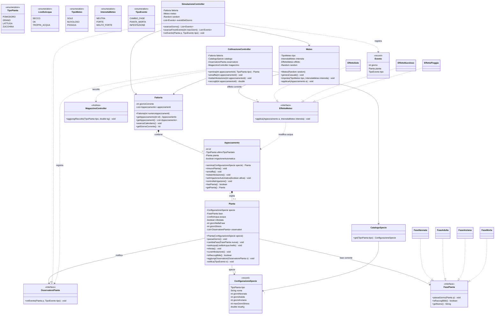

# Class diagram: piante e meteo (bozza)

Aree: Emma (piante, appezzamenti, coltivazione) e Liam (fattoria, meteo, simulazione).
Pattern: **State** (fasi della pianta), **Observer** (eventi della pianta), **Strategy** (effetti del meteo).

> Bozza rivista con l'aiuto di Claude Code, da discutere e approvare insieme prima di scrivere il codice.

## Da decidere insieme

- [ ] Di quanto cambia l'acqua con sole / pioggia per ogni intensità
- [ ] Si può raccogliere anche in `FaseAnziana`?
- [ ] Probabilità di infestazione al giorno
- [ ] `CatalogoSpecie`: dati scritti nel codice o letti dal database?
