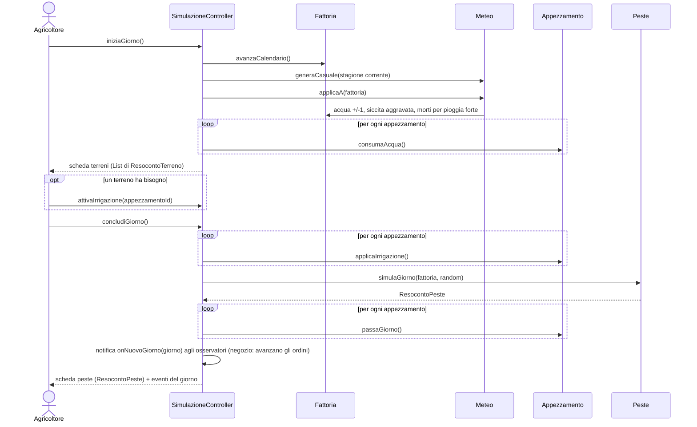

# Class diagram: piante e meteo (bozza v4)

Aree: **Emma** (piante, fasi, appezzamenti, peste, coltivazione) e **Liam** (fattoria, stagioni, meteo, simulazione).

Pattern:
- **State**: fasi della pianta (`FasePianta`), con azione di ingresso `entra()` e regole della peste diverse per fase
- **Observer**: la pianta notifica cambio fase, morte e infestazione (`OsservatorePianta`)
- **Strategy**: effetto di ogni tipo di meteo sulla fattoria (`EffettoMeteo`)

> Bozza rivista con l'aiuto di Claude Code, da discutere e approvare insieme prima di scrivere il codice.
> Le regole del simulatore vanno descritte con parole vostre in `docs/decisioni.md`.

```mermaid
classDiagram
  direction TB

  %% ===== Enumerazioni =====
  class TipoPianta {
    <<enumeration>>
    POMODORO
    GRANO
    LATTUGA
    ZUCCHINA
  }
  class LivelloAcqua {
    <<enumeration>>
    SECCO
    OK
    TROPPA_ACQUA
    +piuAcqua() LivelloAcqua
    +menoAcqua() LivelloAcqua
  }
  class TipoMeteo {
    <<enumeration>>
    SOLE
    NUVOLOSO
    PIOGGIA
  }
  class IntensitaMeteo {
    <<enumeration>>
    NEUTRA
    FORTE
    MOLTO_FORTE
  }
  class Stagione {
    <<enumeration>>
    PRIMAVERA
    ESTATE
    AUTUNNO
    INVERNO
    -double probSole
    -double probNuvoloso
    -double probPioggia
    -double[] probIntensita
    +corrente(Stagione iniziale, int giorno)$ Stagione
  }
  class TipoDanno {
    <<enumeration>>
    SICCITA
    ECCESSO_ACQUA
    INFESTAZIONE
  }
  class TipoEvento {
    <<enumeration>>
    CAMBIO_FASE
    PIANTA_MORTA
    INFESTAZIONE
  }
  class StatoGiornata {
    <<enumeration>>
    IN_ATTESA
    METEO_APPLICATO
  }

  %% ===== Record =====
  class ConfigurazioneSpecie {
    <<record>>
    TipoPianta tipo
    String nome
    int giorniNeonata
    int giorniAdulta
    int giorniAnziana
    Map~TipoDanno_Integer~ maxGiorniDanno
    int giorniConsumoAcqua
    int resaProdotto
    int resaSemi
  }
  class Raccolto {
    <<record>>
    TipoPianta tipo
    int prodotto
    int semi
    +somma(Raccolto altro) Raccolto
  }
  class Posizione {
    <<record>>
    int riga
    int colonna
  }
  class Evento {
    <<record>>
    int giorno
    Pianta pianta
    TipoEvento tipo
  }
  class ResocontoTerreno {
    <<record>>
    int appezzamentoId
    TipoPianta tipo
    LivelloAcqua acqua
    int neonate
    int adulte
    int anziane
    int malate
    int morte
    boolean irrigazioneAttivata
  }
  class PiantaColpita {
    <<record>>
    int appezzamentoId
    Posizione posizione
  }
  class ResocontoPeste {
    <<record>>
    boolean scoppiata
    List~PiantaColpita~ colpite
  }

  %% ===== Piante (Emma) =====
  class CatalogoSpecie {
    +get(TipoPianta tipo) ConfigurazioneSpecie
  }
  class Pianta {
    -ConfigurazioneSpecie specie
    -Posizione posizione
    -FasePianta fase
    -Random random
    -boolean infestata
    -int giorniNellaFase
    -Map~TipoDanno_Integer~ giorniDanno
    -double probabilitaPeste
    -boolean siccitaAggravata
    -List~OsservatorePianta~ osservatori
    +Pianta(ConfigurazioneSpecie specie, Posizione pos, Random random)
    +passaGiorno(LivelloAcqua acqua) void
    +cambiaFase(FasePianta nuova) void
    +infesta() void
    +curaInfestazione() void
    +tentaContagio(Random random) boolean
    +aumentaProbabilitaPeste(double delta) void
    +aggravaSiccita() void
    +uccidi(TipoDanno causa) void
    +puoAmmalarsi() boolean
    +isRaccoglibile() boolean
    +raccogli() Raccolto
    +isMorta() boolean
    +aggiungiOsservatore(OsservatorePianta o) void
    -notifica(TipoEvento e) void
  }
  class FasePianta {
    <<interface>>
    +entra(Pianta p, Random random) void
    +passaGiorno(Pianta p) void
    +incrementoGiornalieroPeste() double
    +puoAmmalarsi() boolean
    +isRaccoglibile() boolean
    +raccogli(Pianta p) Raccolto
    +getNome() String
  }
  class FaseNeonata
  class FaseAdulta
  class FaseAnziana
  class FaseMorta
  class Appezzamento {
    -int id
    -int righe
    -int colonne
    -ConfigurazioneSpecie specie
    -TipoPianta ultimoTipoPiantato
    -Pianta[][] piante
    -LivelloAcqua acqua
    -int giorniSenzaAcqua
    -boolean irrigazioneAttivata
    +Appezzamento(int id, int righe, int colonne)
    +semina(ConfigurazioneSpecie specie, OsservatorePianta o, Random random) void
    +passaGiorno() void
    +getPianta(Posizione pos) Pianta
    +getViciniACroce(Posizione pos) List~Pianta~
    +getPianteVive() List~Pianta~
    +getAcqua() LivelloAcqua
    +aggiungiAcqua() void
    +togliAcqua() void
    +consumaAcqua() void
    +attivaIrrigazione() void
    +applicaIrrigazione() void
    +getCapienza() int
    +trattaInfestazione() void
    +raccogli() Raccolto
    +rimuoviPianteMorte() void
    +isVuoto() boolean
    +creaResoconto() ResocontoTerreno
  }
  class Peste {
    -double probabilitaGiornaliera
    +simulaGiorno(Fattoria f, Random random) ResocontoPeste
  }
  class ColtivazioneController {
    -Fattoria fattoria
    -CatalogoSpecie catalogo
    -OsservatorePianta osservatore
    -MagazzinoController magazzino
    -Random random
    +semina(int appezzamentoId, TipoPianta tipo) void
    +trattaInfestazione(int appezzamentoId) void
    +raccogli(int appezzamentoId) Raccolto
    +rimuoviPianteMorte(int appezzamentoId) void
  }

  %% ===== Simulazione e meteo (Liam) =====
  class Fattoria {
    -int giornoCorrente
    -Stagione stagioneIniziale
    -List~Appezzamento~ appezzamenti
    +Fattoria(Stagione iniziale, List~Appezzamento~ appezzamenti)
    +avanzaCalendario() void
    +getGiornoCorrente() int
    +getStagioneCorrente() Stagione
    +getAppezzamento(int id) Appezzamento
    +getAppezzamenti() List~Appezzamento~
    +getPianteVive() List~Pianta~
    +uccidiPianteCasuali(double percentuale, Random random) void
  }
  class Meteo {
    -TipoMeteo tipo
    -IntensitaMeteo intensita
    -EffettoMeteo effetto
    -Random random
    +Meteo(Random random)
    +generaCasuale(Stagione stagione) void
    +imposta(TipoMeteo tipo, IntensitaMeteo intensita) void
    +applicaA(Fattoria f) void
  }
  class EffettoMeteo {
    <<interface>>
    +applica(Fattoria f, IntensitaMeteo intensita, Random random) void
  }
  class EffettoSole
  class EffettoNuvoloso
  class EffettoPioggia
  class OsservatorePianta {
    <<interface>>
    +onEvento(Pianta p, TipoEvento tipo) void
  }
  class SimulazioneController {
    -Fattoria fattoria
    -Meteo meteo
    -Peste peste
    -Random random
    -StatoGiornata stato
    -List~Evento~ eventiDelGiorno
    +nuovaSimulazione(Stagione iniziale, int numeroAppezzamenti, int righe, int colonne) void
    +iniziaGiorno() List~ResocontoTerreno~
    +attivaIrrigazione(int appezzamentoId) void
    +concludiGiorno() ResocontoPeste
    +getEventiDelGiorno() List~Evento~
    +avanzaFinoAEvento(int maxGiorni) List~Evento~
    +onEvento(Pianta p, TipoEvento tipo) void
    +aggiungiOsservatoreCalendario(OsservatoreCalendario o) void
  }
  class OsservatoreCalendario {
    <<interface>>
    +onNuovoGiorno(int giorno) void
  }

  %% ===== Andrea =====
  class MagazzinoController {
    <<Andrea>>
    +aggiungiRaccolto(TipoPianta tipo, int unita) void
    +aggiungiSemi(TipoPianta tipo, int semi) void
    +prelevaSemi(TipoPianta tipo, int semi) void
    +getSemiDisponibili(TipoPianta tipo) int
  }

  %% ===== Relazioni =====
  Fattoria "1" *-- "1..*" Appezzamento : contiene
  Appezzamento "1" *-- "0..*" Pianta : griglia righe x colonne
  Appezzamento --> "0..1" ConfigurazioneSpecie : specie seminata
  Pianta --> "1" ConfigurazioneSpecie : specie
  Pianta --> "1" Posizione
  CatalogoSpecie --> "*" ConfigurazioneSpecie

  Pianta --> "1" FasePianta : fase corrente
  FaseNeonata ..|> FasePianta
  FaseAdulta ..|> FasePianta
  FaseAnziana ..|> FasePianta
  FaseMorta ..|> FasePianta

  Pianta --> "0..*" OsservatorePianta : notifica
  SimulazioneController ..|> OsservatorePianta
  SimulazioneController ..> Evento : registra

  Meteo --> "1" EffettoMeteo : effetto corrente
  EffettoSole ..|> EffettoMeteo
  EffettoNuvoloso ..|> EffettoMeteo
  EffettoPioggia ..|> EffettoMeteo
  EffettoMeteo ..> Fattoria : modifica

  Peste ..> Fattoria
  Peste ..> ResocontoPeste : crea
  Appezzamento ..> ResocontoTerreno : crea
  Appezzamento ..> Raccolto : crea

  SimulazioneController --> Fattoria
  SimulazioneController --> Meteo
  SimulazioneController --> Peste
  SimulazioneController --> "0..*" OsservatoreCalendario : notifica nuovo giorno
  ColtivazioneController --> Fattoria
  ColtivazioneController --> CatalogoSpecie
  ColtivazioneController ..> OsservatorePianta : registra
  ColtivazioneController ..> MagazzinoController : raccolto e semi
```

## Flusso di una giornata

## Parametri delle specie

| | Pomodoro | Grano | Lattuga | Zucchina |
|---|---|---|---|---|
| `TipoPianta` | `POMODORO` | `GRANO` | `LATTUGA` | `ZUCCHINA` |
| Giorni neonata / adulta / anziana | 15 / 50 / 15 | 12 / 70 / 15 | 7 / 20 / 5 | 8 / 35 / 10 |
| Max giorni siccità | 3 | 6 | 2 | 2 |
| Max giorni eccesso d'acqua | 2 | 3 | 1 | 2 |
| Max giorni infestazione | 4 | 7 | 2 | 3 |
| Consumo d'acqua (ogni N giorni −1 livello) | 2 | 6 | 1 | 1 |
| Resa prodotto per pianta (fase adulta) | 15 | 35 | 1 | 10 |
| Resa semi per pianta (fase anziana) | 5 | 18 | 7 | 4 |

- Limite di siccità con sole forte: metà del valore, arrotondata per difetto, minimo 1 (pomodoro 1, grano 3, lattuga 1, zucchina 1).
- Consumo d'acqua: ogni `giorniConsumoAcqua` giorni senza pioggia né irrigazione, l'acqua del terreno scende di un livello. Pioggia e irrigazione azzerano il conteggio.
- Raccolto: in fase adulta si ottiene il prodotto, in fase anziana i semi; neonata e morta non si raccolgono. La pianta raccolta viene tolta dalla griglia.

## Decisioni prese

- **Irrigazione**: l'agricoltore la attiva su un terreno dopo aver visto la scheda; a fine giornata riporta a OK il terreno se è SECCO (non toglie l'acqua in eccesso) e poi **si spegne da sola**. Il giorno dopo, se serve, va riattivata.
- **Semi**: si possono vendere oppure ripiantare. Per seminare un appezzamento servono **righe x colonne semi** della specie, prelevati dal magazzino; se non bastano, la semina non avviene (flusso alternativo "semi insufficienti").
- **Raccolto unico** per tutte le specie.
- **Autunno**: intensità 50% / 42,5% / 7,5% (pioggia forte = 3%).
- Prodotto e semi si contano in **unità**.

## Punti di contatto con il magazzino (Andrea)

| Chi chiama | Metodo | Quando |
|---|---|---|
| `ColtivazioneController.semina()` | `magazzino.getSemiDisponibili(tipo)` e `magazzino.prelevaSemi(tipo, capienza)` | prima di seminare |
| `ColtivazioneController.raccogli()` | `magazzino.aggiungiRaccolto(tipo, unita)` | raccolto in fase adulta |
| `ColtivazioneController.raccogli()` | `magazzino.aggiungiSemi(tipo, semi)` | raccolto in fase anziana |

## Da confermare

- [ ] Semi iniziali: con quanti semi parte una nuova simulazione? (es. abbastanza per riempire un appezzamento di ogni specie)
