# Class diagram: utenti, magazzino e negozio (bozza v1)

Area: **Andrea** (utenti, magazzino, e-commerce, database).

Pattern:
- **Factory**: `UtenteFactory` crea `Agricoltore` o `Compratore` a partire dal ruolo salvato nel database
- **Singleton**: `ConnectionManager`, una sola connessione al database per tutti i DAO
- **Observer**: `NegozioController` osserva il calendario della simulazione e a ogni nuovo giorno fa avanzare gli ordini

> Bozza rivista con l'aiuto di Claude Code, da discutere e approvare insieme prima di scrivere il codice.

```mermaid
classDiagram
  direction TB

  %% ===== Utenti =====
  class Ruolo {
    <<enumeration>>
    AGRICOLTORE
    COMPRATORE
  }
  class Utente {
    <<abstract>>
    -int id
    -String username
    -String email
    -String passwordHash
    +verificaPassword(String password) boolean
    +getRuolo() Ruolo*
  }
  class Agricoltore
  class Compratore {
    -String indirizzoSpedizione
  }
  class UtenteFactory {
    +crea(Ruolo r, int id, String username, String email, String hash) Utente$
  }

  %% ===== Magazzino =====
  class Categoria {
    <<enumeration>>
    PRODOTTO
    SEMI
  }
  class Giacenza {
    -TipoPianta tipo
    -Categoria categoria
    -int quantita
    +aggiungi(int unita) void
    +preleva(int unita) void
  }
  class RigaMagazzino {
    <<record>>
    TipoPianta tipo
    Categoria categoria
    int quantita
    boolean inVendita
  }
  class Bilancio {
    <<record>>
    double totaleIncassato
    int unitaVendute
    int ordiniTotali
    int ordiniAnnullati
  }

  %% ===== Negozio =====
  class Annuncio {
    -int id
    -TipoPianta tipo
    -Categoria categoria
    -String titolo
    -String descrizione
    -double prezzoUnitario
    -boolean attivo
    -List~Recensione~ recensioni
    +getMediaVoti() double
  }
  class Recensione {
    <<record>>
    int id
    Compratore autore
    int voto
    String testo
    int giorno
  }
  class Carrello {
    -Compratore compratore
    -List~RigaCarrello~ righe
    +aggiungi(Annuncio a, int quantita) void
    +rimuovi(int annuncioId) void
    +svuota() void
    +getTotale() double
    +isVuoto() boolean
  }
  class RigaCarrello {
    <<record>>
    Annuncio annuncio
    int quantita
  }
  class StatoOrdine {
    <<enumeration>>
    ORDINATO
    IN_PARTENZA
    IN_TRANSITO
    IN_CONSEGNA
    CONSEGNATO
    ANNULLATO
    +successivo() StatoOrdine
    +isConcluso() boolean
  }
  class Ordine {
    -int id
    -Compratore compratore
    -List~RigaOrdine~ righe
    -StatoOrdine stato
    -int giornoOrdine
    -int giornoUltimoAggiornamento
    +getTotale() double
    +avanzaStato(int giorno) void
    +annulla() void
    +contiene(int annuncioId) boolean
  }
  class RigaOrdine {
    <<record>>
    Annuncio annuncio
    int quantita
    double prezzoUnitario
    +getSubtotale() double
  }

  %% ===== Controller =====
  class LoginController {
    -Utente utenteCorrente
    +registra(String username, String email, String password, Ruolo r) Utente
    +login(String username, String password) Utente
    +logout() void
    +getUtenteCorrente() Utente
  }
  class MagazzinoController {
    +aggiungiRaccolto(TipoPianta tipo, int unita) void
    +aggiungiSemi(TipoPianta tipo, int semi) void
    +prelevaSemi(TipoPianta tipo, int semi) void
    +getSemiDisponibili(TipoPianta tipo) int
    +getResoconto() List~RigaMagazzino~
    +getBilancio() Bilancio
  }
  class NegozioController {
    -LoginController login
    -MagazzinoController magazzino
    -Carrello carrello
    -int giornoCorrente
    +pubblicaAnnuncio(TipoPianta t, Categoria c, String titolo, String descrizione, double prezzo) Annuncio
    +ritiraAnnuncio(int annuncioId) void
    +getVetrina() List~Annuncio~
    +aggiungiAlCarrello(int annuncioId, int quantita) void
    +rimuoviDalCarrello(int annuncioId) void
    +getCarrello() Carrello
    +confermaOrdine() Ordine
    +annullaOrdine(int ordineId) void
    +getMieiOrdini() List~Ordine~
    +recensisci(int annuncioId, int voto, String testo) Recensione
    +onNuovoGiorno(int giorno) void
  }
  class OsservatoreCalendario {
    <<interface>>
    +onNuovoGiorno(int giorno) void
  }
  class SimulazioneController {
    <<Liam>>
    +aggiungiOsservatoreCalendario(OsservatoreCalendario o) void
  }

  %% ===== Persistenza =====
  class ConnectionManager {
    <<singleton>>
    -ConnectionManager instance$
    -ConnectionManager()
    +getInstance() ConnectionManager$
    +getConnection() Connection
  }
  class UtenteDAO
  class GiacenzaDAO
  class AnnuncioDAO
  class RecensioneDAO
  class OrdineDAO {
    +inserisci(Ordine o) void
    +aggiornaStato(Ordine o) void
    +trovaPerCompratore(int compratoreId) List~Ordine~
    +trovaDaAvanzare() List~Ordine~
    +calcolaBilancio() Bilancio
  }

  %% ===== Relazioni =====
  Utente <|-- Agricoltore
  Utente <|-- Compratore
  UtenteFactory ..> Utente : crea

  Annuncio "1" *-- "0..*" Recensione
  Recensione --> "1" Compratore : autore
  Carrello "1" *-- "0..*" RigaCarrello
  Carrello --> "1" Compratore
  RigaCarrello --> "1" Annuncio
  Ordine "1" *-- "1..*" RigaOrdine
  RigaOrdine --> "1" Annuncio
  Ordine --> "1" Compratore
  Ordine --> StatoOrdine
  MagazzinoController ..> Giacenza

  NegozioController ..|> OsservatoreCalendario
  SimulazioneController --> "0..*" OsservatoreCalendario : notifica nuovo giorno
  NegozioController ..> LoginController : chi è connesso
  NegozioController ..> MagazzinoController : disponibilità

  UtenteDAO ..> ConnectionManager
  GiacenzaDAO ..> ConnectionManager
  AnnuncioDAO ..> ConnectionManager
  RecensioneDAO ..> ConnectionManager
  OrdineDAO ..> ConnectionManager
```

## Decisioni prese

- **Utenti**: due ruoli, `AGRICOLTORE` (venditore, gestisce fattoria, magazzino e negozio) e `COMPRATORE`. C'è un solo agricoltore: la vetrina mostra solo i suoi annunci.
- **Magazzino**: una giacenza per ogni coppia (tipo di pianta, categoria). Prodotto e semi entrano **in automatico** dopo il raccolto. Si conta in **unità**.
- **Annunci**: l'agricoltore li crea quando vuole; **tutti i campi sono obbligatori** (titolo e descrizione non vuoti, prezzo > 0). L'annuncio non ha una quantità propria: la disponibilità è quella del magazzino.
- **Carrello**: un ordine può contenere **più articoli diversi**. La conferma dell'ordine è **tutto o niente**: se anche una sola riga non è disponibile, l'ordine non viene creato e il magazzino non cambia (transazione JDBC con commit / rollback).
- **Prezzo**: ogni `RigaOrdine` salva il prezzo del momento dell'acquisto, così il bilancio resta corretto anche se poi il prezzo cambia.
- **Stato dell'ordine**: avanza **in automatico di uno stato a ogni giorno simulato** (ORDINATO → IN_PARTENZA → IN_TRANSITO → IN_CONSEGNA → CONSEGNATO): un ordine arriva in 4 giorni.
- **Annullamento**: possibile solo nello stato ORDINATO; le unità tornano in magazzino. Conseguenza: visto che lo stato avanza ogni giorno, si può annullare **solo nello stesso giorno dell'ordine**.
- **Recensioni**: solo i compratori con un ordine **CONSEGNATO** che contiene quell'annuncio. Voto da 1 a 5 più testo.
- **Date**: si usa il **giorno simulato** della fattoria, non la data reale.
- **Bilancio**: calcolato con una query di aggregazione sugli ordini non annullati.

## Punti di contatto

| Chi chiama | Metodo | Quando |
|---|---|---|
| Emma: `ColtivazioneController.semina()` | `getSemiDisponibili(tipo)`, `prelevaSemi(tipo, capienza)` | prima di seminare |
| Emma: `ColtivazioneController.raccogli()` | `aggiungiRaccolto(tipo, unita)`, `aggiungiSemi(tipo, semi)` | dopo il raccolto |
| Liam: `SimulazioneController.concludiGiorno()` | `osservatore.onNuovoGiorno(giorno)` | a fine giornata: il negozio fa avanzare gli ordini |

Grazie all'Observer, il codice di Liam non dipende dal negozio: conosce solo l'interfaccia `OsservatoreCalendario`.

## Casi d'uso della parte C

| Id | Caso d'uso | Attore | Flussi alternativi |
|---|---|---|---|
| C1 | Registrarsi | Agricoltore, Compratore | username o email già usati |
| C2 | Autenticarsi «function» | Agricoltore, Compratore | credenziali errate |
| C3 | Consultare la vetrina | Compratore | nessun annuncio attivo |
| C4 | Gestire il carrello | Compratore | quantità maggiore della disponibilità |
| C5 | Confermare un ordine | Compratore | carrello vuoto; un articolo non più disponibile (rollback) |
| C6 | Seguire i propri ordini | Compratore | nessun ordine |
| C7 | Annullare un ordine | Compratore | ordine già partito |
| C8 | Recensire un articolo | Compratore | nessun ordine consegnato con quell'articolo; voto fuori da 1–5 |
| C9 | Pubblicare un annuncio | Agricoltore | campo mancante o prezzo non valido |
| C10 | Ritirare un annuncio | Agricoltore | annuncio inesistente |
| C11 | Consultare il magazzino | Agricoltore | magazzino vuoto |
| C12 | Consultare il bilancio | Agricoltore | nessuna vendita |

Per tutti: un utente con il ruolo sbagliato non può eseguire il caso d'uso (es. un compratore che prova a pubblicare un annuncio).

## Priorità di implementazione

1. **Essenziale**: login con ruoli, magazzino, annunci, carrello e ordine, avanzamento degli stati
2. **Importante**: annullamento, bilancio (query)
3. **Se avanza tempo**: recensioni

## Da confermare

- [ ] Una sola recensione per compratore e per annuncio?
- [ ] Il carrello resta solo in memoria (si perde al logout) o va salvato nel database?
